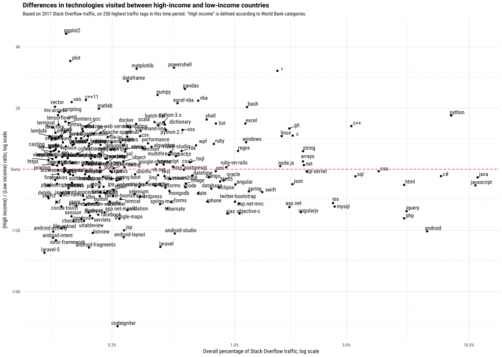

# La brecha tecnológica entre países desarrollados y en vías de desarrollo vista por los lenguajes de programación

A finales de agosto, [David
Robinson](https://stackoverflow.blog/authors/drobinson/), científico
de datos de la empresa [*Stack Overflow*](https://stackoverflow.com)
publico un
[análisis](https://stackoverflow.blog/2017/08/29/tale-two-industries-programming-languages-differ-wealthy-developing-countries/)
que lleva a una conclusión muy interesante: existe una pequeña, pero
estadísticamente significativa diferencia entre las tecnologías y
lenguajes de programación que utilizan los desarrolladores en los
países considerados como *desarrollados* a las que se utilizan en los
países considerados en *vías de desarrollo*. 

*Stack Overflow* es, por amplio margen, el foro preferido por la
mayoría de los desarrolladores. *Stack Oerflow* no es solamente un
foro de preguntas y respuestas, ya que se a convertido básicamente en
la fuente de documentación primaria para la mayoría de los
desarrolladores, en básicamente dos los lenguajes de
programación. Cada pregunta es clasificada por etiquetas sobre la
tecnología, sistema operativo, lenguaje de programación, y otra
información que sirva para reagrupar las ideas. Esto permite seguir
rápidamente las preguntas y respuestas. 

La metodología utilizada fue la siguiente: Se revisaron las 250
etiquetas más populares de las visitas realizadas entradas
(preguntas/respuestas) entre enero y agosto de 2017. Para hacer un
análisis más robusto, se utilizó únicamente la información de 64
países, los cuales tuvieran *al menos* cinco millones de visitas en el
período de tiempo del análisis. La diferenciación entre paises
desarrollados y en vías de desarrollo se realizó de acuerdo a los
criterios del Banco Mundial, como se muestra en este [listado de
wikipedia](https://en.wikipedia.org/wiki/World_Bank_high-income_economy).

En la gráfica que vemos a continuación (del análisis de Robinson), se
puede ver la relación entre visitas realizadas de paises
*desarrollados* y *en vías de desarrollo* en relación a la cantidad
total de visitas.

En la gráfica podemos ver que las etiquetas más consultadas fueron
`java`, `javascript`, `python` y `c#` en ese orden. Mientras que
`java` y `javascript` son ligeramente más consultados desde países en
vías de desarrollo, `pythn`es más consultado por países
desarrollados. Igualmente podemos ver que hay tecnologias (como
`ggplot2`, una herramienta del lenguaje de programación `R`) que son
cláramente consultados en paises desarrollados, otras que son
cláramente tecnologías que se utilizan en países en vías de desarrollo
(como `laravel`, un *framework* para el lenguaje *php*).

Si reagrupamos las mayoría de dichas etiquetas en cuatro grandes
grupos (`android`, `php`, python` y `R`) y por cada una de ellas se
genera un gráfico con la relación del PIB per cápita con porcentaje de
entradas por pais se obtiene un resultado muy interesante, tal como se
ve en la figura.

Estos resultados se pueden deber a dos posibles situaciones:

1. *La emergencia de la Ciencia de Datos en los países
   desarrollados*. Los lenguajes *Python* y *R* están claramente
   asociados a países desarrollados (*Python* tiene el doble de
   entradas en los países desarrollados y *R* es visitado
   aproximadamente trés veces más que en los países en vías de
   desarrollo). Es de notarse que, entre las etiquetas asociadas a
   estos lenguajes que marcaron la diferencia se encuentran
   bibliotecas y paquetes de corte científico (muy utilizado en
   ciencia de datos) tales como `ggplot2`, `matplotlib`, `numpy` o
   `pandas`. Esto sugiere que la brecha económica entre países está
   correlacionada a una diferencia en el manejo de tecnología. Los
   paises desarrollados centran más su econocía en la investigación y
   desarrollo y los programadores suelen contar con mayor preparación
   y estudios de posgrado.
   
2. *Los paises en vías de desarrollo explotan el *outsourcing*.El
   desarrollo de aplicaciones para *Android* así como en *PHP* está
   asociado claramente con los países en vías de desarrollo, En
   particular *CodeIgnter*, un *framework* para *PHP* es la etiqueta
   mas desproporcionada visitada por un gran margen desde paises en
   vías de desarrollo del sur de Asia. Casi todas las etiquetas con
   mayor margen para los países en vías de desarrollo están asociados
   a aplicaciones web y/o aplicaciones móviles, típicamente
   subcontratadas.

Este es el estado en términos generales, en el cual, se intuye que los
países en vías de desarrollo se especializan en la subcontratación (lo
que se conoce vulgarmente como *maquila de software*) utilizando
tecnologías y herramientas bien conocidas, mientras que la mayor parte
de la innovación se realiza en los países desarrollados. 

Un [estudio
posteror](https://stackoverflow.blog/2017/09/06/incredible-growth-python/)
(del 6 de septiembre de 2017) realizado por el mismo Robinson,
muestran que si bien *Python* tiene menor popularidad que otras
tecnologías en los países en vías de desarrollo, su crecimiento es
similar al experimentado por los países desarrollados, como podemos
ver en la siguiente figura.

De acuerdo a este estudio, puede intuirse que el desarrollo de
aplicaciones relacionados con ciencia de datos también va en aumento
en los países en vías de desarrollo, a pesar que queda oculto por la
subcontratación para el desarrollo de aplicaciones Web y aplicaciones
móviles.

Si queremos que nuestra región sea puntera en el desarrollo de
*Software* con alto valor agregado, es necesario formar cuadros
profesionales con conocimientos y bases técnicas y teóricas que
permitan utilizar las herramientas avanzadas relacionadas con los
lenguajes de programación *Python* y *R*. Es de destacar que para el
uso de estas tecnologías se requiere de formación formal en áreas como
álgebra lineal, estadística y optimización, así como experiencia en el
manejo y tratamiento de datos. 

